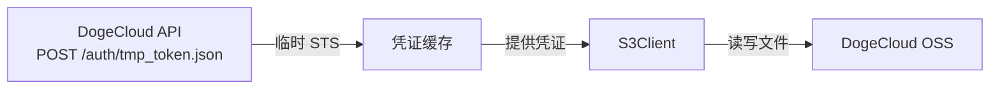

# LobeHub DogeCloud Patch

自动追踪 LobeHub tag 发布，打补丁使其支持[多吉云 DogeCloud](https://docs.dogecloud.com/oss/api-introduction) 临时 S3 凭证并构建 Docker 镜像发布到 GHCR。

## 原理

LobeHub 的 S3 存储使用静态环境变量（`S3_ACCESS_KEY_ID` / `S3_SECRET_ACCESS_KEY`）配置凭证。
本补丁在 `S3` 类上添加了一个**动态凭证注册钩子**，允许通过平台 API 获取临时 STS 令牌。



## 文件说明

| 文件 | 说明 |
|------|------|
| `patches/s3-credential-hook.patch` | 修改 `S3/index.ts`，添加 `setCredentialProvider` 钩子 |
| `patches/dogecloud-credential-store.ts` | 从多吉云获取临时凭证并注册到钩子 |
| `scripts/apply-patches.sh` | 一键打补丁脚本 |
| `.github/workflows/build-on-release.yml` | 自动构建工作流 |

## 环境变量

### 必填

| 变量 | 说明 |
|------|------|
| `DOGECLOUD_ACCESS_KEY` | 多吉云永久 AccessKey（用户中心→密钥管理） |
| `DOGECLOUD_SECRET_KEY` | 多吉云永久 SecretKey |
| `DOGECLOUD_BUCKET` | 云存储空间名称，如 `my-bucket` |

### 可选

| 变量 | 默认值 | 说明 |
|------|--------|------|
| `DOGECLOUD_CHANNEL` | `OSS_FULL` | 密钥类型：`OSS_FULL` / `OSS_UPLOAD` / `OSS_CUSTOM` |
| `DOGECLOUD_SCOPES` | `*` | 权限范围，多个用逗号分隔 |
| `DOGECLOUD_TTL` | `7200` | 临时密钥有效期（秒），最大 7200 |

LobeHub 原有 S3 环境变量仍需配置：

| 变量 | 说明 |
|------|------|
| `S3_ENDPOINT` | DogeCloud OSS 的 S3 兼容 endpoint（从 Bucket 详情页获取） |
| `S3_BUCKET` | DogeCloud 返回的 `s3Bucket` 值（格式如 `s-cd-1-mybucket-123456789`） |
| `S3_ENABLE_PATH_STYLE` | 一般设为 `1` |
| `S3_REGION` | 如 `us-east-1` |

## 使用方法

### 方式一：直接使用 GHCR 镜像

```bash
docker pull ghcr.io/inkOrCloud/lobehub-dogecloud-patch:latest
```

### 方式二：手动打补丁

```bash
# 克隆 LobeHub
git clone --depth 1 https://github.com/lobehub/lobe-chat.git
cd lobe-chat

# 打补丁
bash /path/to/lobehub-dogecloud-patch/scripts/apply-patches.sh .
```

### 方式三：触发 GitHub Actions

在仓库的 Releases 页面创建一个新 release，或通过 Actions 页面手动触发 `workflow_dispatch`。

## 构建产物

每次构建会推送两个标签到 `ghcr.io`：

- `ghcr.io/inkOrCloud/lobehub-dogecloud-patch:latest`
- `ghcr.io/inkOrCloud/lobehub-dogecloud-patch:<semver>`（如 `v1.30.0`）
