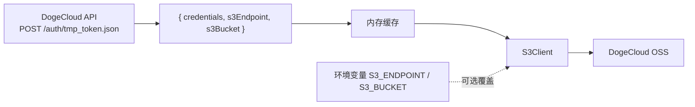

# LobeHub DogeCloud Patch

自动追踪 LobeHub tag 发布，打补丁使其支持[多吉云 DogeCloud](https://docs.dogecloud.com/oss/api-introduction) 临时 S3 凭证并构建 Docker 镜像发布到 GHCR。

## 兼容性

| 补丁版本 | 最低 LobeHub 版本 | 目录结构 |
|----------|-------------------|----------|
| 当前     | `v2.2.3`         | `apps/server/` (turborepo) |
| 旧版     | `v1.0.0` ~ `v2.2.2` | `src/server/` (legacy) |

> 当前补丁仅支持 **v2.2.3 及以上**版本。如果需要对更早版本打补丁，请 checkout 旧版 `s3-credential-hook.patch`。

## 原理

LobeHub 的 S3 存储使用静态环境变量（`S3_ACCESS_KEY_ID` / `S3_SECRET_ACCESS_KEY`）配置凭证。
本补丁在 `S3` 类上添加了一个**动态凭证注册钩子**，允许通过平台 API 获取完整的 S3 配置（凭证 + endpoint + bucket）。



### 配置来源优先级

```
s3Endpoint / s3Bucket 决定方式:
  1. 环境变量 S3_ENDPOINT / S3_BUCKET (最高优先级，手动覆盖)
  2. DogeCloud API 返回的 s3Endpoint / s3Bucket (模块加载时自动获取)
  3. 原有 fileEnv 环境变量 (最后回退)
```

## 文件说明

| 文件 | 说明 |
|------|------|
| `patches/s3-credential-hook.patch` | 修改 `S3/index.ts`，添加 `setCredentialProvider` 钩子 |
| `patches/dogecloud-credential-store.ts` | 从多吉云获取临时凭证并注册到钩子 |
| `scripts/apply-patches.sh` | 一键打补丁脚本 |
| `.github/workflows/build-on-release.yml` | 自动构建工作流 |

## 环境变量

### 必填（DogeCloud 凭证）

| 变量 | 说明 |
|------|------|
| `DOGECLOUD_ACCESS_KEY` | 多吉云永久 AccessKey（用户中心→密钥管理） |
| `DOGECLOUD_SECRET_KEY` | 多吉云永久 SecretKey |
| `DOGECLOUD_BUCKET` | 云存储空间名称，如 `my-bucket` |

### 可选

| 变量 | 默认值 | 说明 |
|------|--------|------|
| `DOGECLOUD_CHANNEL` | `OSS_FULL` | 密钥类型：`OSS_FULL` / `OSS_UPLOAD` / `OSS_CUSTOM` |
| `DOGECLOUD_SCOPES` | `*` | 权限范围，多个用逗号分隔 |
| `DOGECLOUD_TTL` | `7200` | 临时密钥有效期（秒），最大 7200 |
| `S3_ENDPOINT` | — | **手动覆盖** s3Endpoint |
| `S3_BUCKET` | — | **手动覆盖** s3Bucket |

> 正常情况下不需要设 `S3_ENDPOINT` 和 `S3_BUCKET`，首次 API 调用会自动获取。
> 仅当 DogeCloud 更换存储后端导致自动获取的值不生效时，才用这两个变量强制覆盖。

LobeHub 原有 S3 环境变量**不再需要**配置（如果你设了它们会作为最后回退）：

| 变量 | 说明 |
|------|------|
| `S3_ACCESS_KEY_ID` | 不需要，由 DogeCloud 临时凭证提供 |
| `S3_SECRET_ACCESS_KEY` | 不需要，由 DogeCloud 临时凭证提供 |
| `S3_ENABLE_PATH_STYLE` | 保持 `1` |
| `S3_REGION` | 保持 `us-east-1` |

## 使用方法

### 方式一：直接使用 GHCR 镜像

```bash
docker pull ghcr.io/inkOrCloud/lobehub-dogecloud-patch:latest
```

### 方式二：手动打补丁

```bash
git clone --depth 1 --branch v2.2.3 https://github.com/lobehub/lobe-chat.git
cd lobe-chat
bash /path/to/lobehub-dogecloud-patch/scripts/apply-patches.sh .
```

然后在入口文件添加一行：

```ts
// apps/server/src/hono/standalone.ts 或其它服务端入口
import '../patches/dogecloud-credential-store';
```

### 方式三：触发 GitHub Actions

在仓库的 Releases 页面创建一个新 release，或通过 Actions 页面手动触发。

> ⚠️ 工作流会自动校验 LobeHub tag 版本是否 ≥ v2.2.3，不满足时提前报错。

### GHCR 推送权限配置

工作流默认使用 `GITHUB_TOKEN` 登录 GHCR。如果遇到 `denied: installation not allowed to Create organization package` 错误，有两种解决方式：

#### 方式 A：配置仓库权限（推荐）

仓库 **Settings → Actions → General → Workflow permissions**：
- 选择 **"Read and write permissions"**
- 勾选 **"Allow GitHub Actions to create and approve pull requests"**

#### 方式 B：使用 Personal Access Token

如果方式 A 不足以解决问题（例如组织级别限制了 GITHUB_TOKEN 的 package 创建权限），可以创建一个 PAT 并配置为仓库 Secret：

1. 在 GitHub **Settings → Developer settings → Personal access tokens → Fine-grained tokens** 创建一个 token
   - 权限范围：选择 `inkOrCloud/lobehub-dogecloud-patch` 仓库
   - 至少勾选 **Contents: Read** 和 **Packages: Write**
2. 在仓库 **Settings → Secrets and variables → Actions** 添加一个名为 **`GHCR_PAT`** 的 Secret
3. 将上一步创建的 token 粘贴进去

配置后工作流会自动优先使用 `GHCR_PAT`，不存在时回退到 `GITHUB_TOKEN`。

## 构建产物

每次构建会推送两个标签到 `ghcr.io`：

- `ghcr.io/inkOrCloud/lobehub-dogecloud-patch:latest`
- `ghcr.io/inkOrCloud/lobehub-dogecloud-patch:<semver>`
